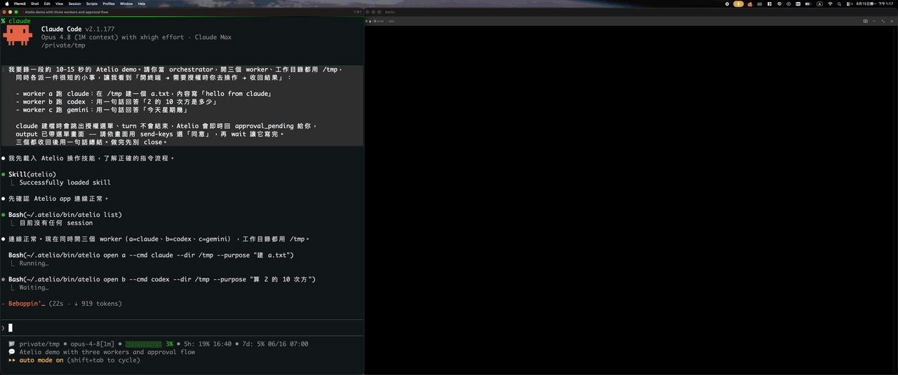

[English](README.md) | [繁體中文](README.zh-TW.md)

# Atelio

一個 macOS 容器，在終端機視窗裡跑多個 AI CLI（Claude Code、Codex、Gemini …）作為 worker，由你的主 AI 透過簡單的 `atelio` 指令列控制。像 PM 派任務一樣，並行調度多個 AI worker。

**[下載最新版本](https://github.com/dark-zixin/Atelio/releases/latest)**

  

## 解決什麼問題

你想讓好幾個 AI CLI 同時做事——一個審程式碼、一個寫測試、一個查資料——但它們各自待在獨立的終端機裡：

- **沒有統一的控制** — 你得手動切視窗、盯著看完成沒、在它們之間複製貼上
- **沒有「turn 完成」訊號** — 終端多工器（tmux）能把視窗排好，但它不懂 AI CLI 何時*跑完一個 turn*，所以你無法程式化地收割結果
- **一個 orchestrator、多個 worker** — 沒有乾淨的方式讓單一主 AI 去派任務、觀察、協調其他 AI worker

## 運作方式

1. Atelio 把每個 AI CLI 當成 **worker** 跑在一個終端 session 裡
2. 你的主 AI 透過 `atelio` 指令操作它們——`open` / `dispatch` / `wait` / `screen`
3. Atelio 偵測每個 worker 何時**跑完一個 turn**（透過 hook，或畫面穩定啟發式），並回傳只屬於該 turn 的去噪輸出

你的主 AI 是 orchestrator（PM）；Atelio 負責管終端、收送文字、回報狀態——它不替你做路由或決策。

## 截圖

<!-- screenshots: TBD -->

## 功能

- **多 session 終端容器**，自動排版（1 全螢幕 / 2 左右 / 2×2 grid）
- **CLI 驅動的編排** — `open` / `dispatch` / `wait` / `screen` / `send-keys` / `reset` / `close`
- **turn 完成偵測** — 精確的 hook 通知，搭配畫面穩定啟發式作為後備
- **owner 綁定** — 你開的 session 只有你能操作，其他人唯讀
- **approval 處理** — `send-keys` 操作 worker 的 TUI 選單（授權提示）
- **輸出去噪 + turn 切片** — 只回傳本輪乾淨的輸出
- **任意 AI CLI** — 內建 `claude` / `codex` / `gemini` / `aider` 白名單，可透過 config 擴充
- **不需特殊權限** — 無需輔助使用 / 螢幕錄製；本機 Unix socket、不連外

## 系統需求

- macOS 26.4 或更新版本
- 你要當 worker 用的 AI CLI 自行安裝（如 `claude` / `codex` / `gemini`）

## 安裝

1. 從 [Releases](../../releases) 下載最新的 `Atelio.dmg`
2. 打開 DMG，把 **Atelio** 拖進**應用程式**資料夾
3. 從 Launchpad / 應用程式啟動

首次啟動時 Atelio 會自動建立 `~/.atelio/`（設定、log、socket、CLI symlink、操作手冊鏡像），無需手動設定。

> 若 macOS 攔阻 app，在 Atelio.app 上按右鍵 >「打開」一次即可。（公證版可直接開。）

## 首次設定：讓你的 AI 讀懂 Atelio

Atelio 附一份操作手冊（skill），啟動後已鏡像到 `~/.atelio/skills/atelio/`。最後一步是把它接進你主 AI 的 skill 搜尋目錄：

- **最省事** — 開 Atelio 的「說明」視窗，複製那段 prompt 貼給你的 AI，讓它依自己的環境接好
- **手動** — 把 `~/.atelio/skills/atelio` 用 symlink 連到你的 AI skill 目錄（建議 symlink，App 更新會自動跟上）。常見位置：Claude Code `~/.claude/skills/`、Codex / Gemini `~/.agents/skills/`

接好後，你就能用自然語言叫主 AI：「開一個 codex worker 在 /repo 做 X」。

## 使用方式

日常操作由你的主 AI 透過 skill 進行，你只要讓 Atelio 開著。底層 CLI 在固定路徑 `~/.atelio/bin/atelio`：

| 指令 | 作用 |
|---|---|
| `atelio open <name> --cmd <cli> --dir <路徑>` | 開一個 worker session |
| `atelio dispatch <name> "<任務>"` | 派任務並等完成 |
| `atelio wait <name>` | 等進行中的 turn 完成 |
| `atelio screen <name>` | 看當前畫面（唯讀，不限 owner） |
| `atelio list` / `atelio status <name>` | 查 session 狀態 |
| `atelio send-keys <name> <key>` | 送按鍵到 TUI（approval 選單） |
| `atelio reset <name>` | 強制結束卡住的 turn |
| `atelio close <name>` | 關閉 session |

完整指令、result 判讀與工作流見 [`skill/atelio/SKILL.md`](skill/atelio/SKILL.md)。App 內「說明」視窗也有速查與快捷鍵。

### 快捷鍵

`⌘=` 放大文字 · `⌘-` 縮小 · `⌘0` 重設 · `⌘W` 關視窗（App 繼續跑） · `⌘Q` 結束 Atelio

## 信任模型

Atelio 是本機桌面 App，以你一般使用者身分執行：

- 它 spawn 的 worker 就是**你自己安裝**的 AI CLI，用你的 shell 環境跑
- IPC 走本機 Unix domain socket（`~/.atelio/atelio.sock`）——**自身不開任何網路連線**
- 所有資料集中在 `~/.atelio/`
- **不需要**輔助使用、螢幕錄製、完整磁碟取用等特殊系統權限

## 解除安裝

1. 刪除 `/Applications/Atelio.app` 與 `~/.atelio/`
2. 移除你 AI skill 目錄裡的 `atelio` symlink（如 `~/.claude/skills/atelio`）
3. 若曾安裝完成偵測 hook，移除各 AI CLI 設定裡指向 `~/.atelio/notify.sh` 的項目

## 從原始碼建置

1. Clone 此 repository
2. 用 Xcode 開啟 `Atelio/Atelio.xcodeproj`
3. 選 **Atelio** scheme 並執行（需要 macOS 26.4+ SDK）

SwiftTerm 依賴由 Swift Package Manager 自動解析；bundle 內含的 AtelioCLI 與 AtelioShared.framework 由 build 自動處理。

## 貢獻

歡迎提交 Issue 和 Pull Request。回報 bug 時請附上 macOS 版本和你當作 worker 執行的 AI CLI。

## 授權

[MIT License](LICENSE) © 2026 dark-zixin
